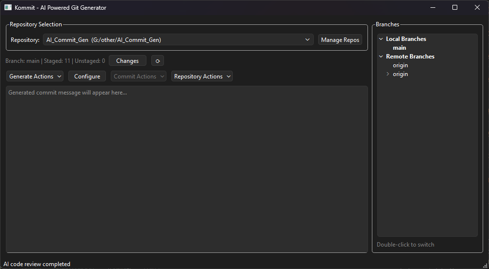
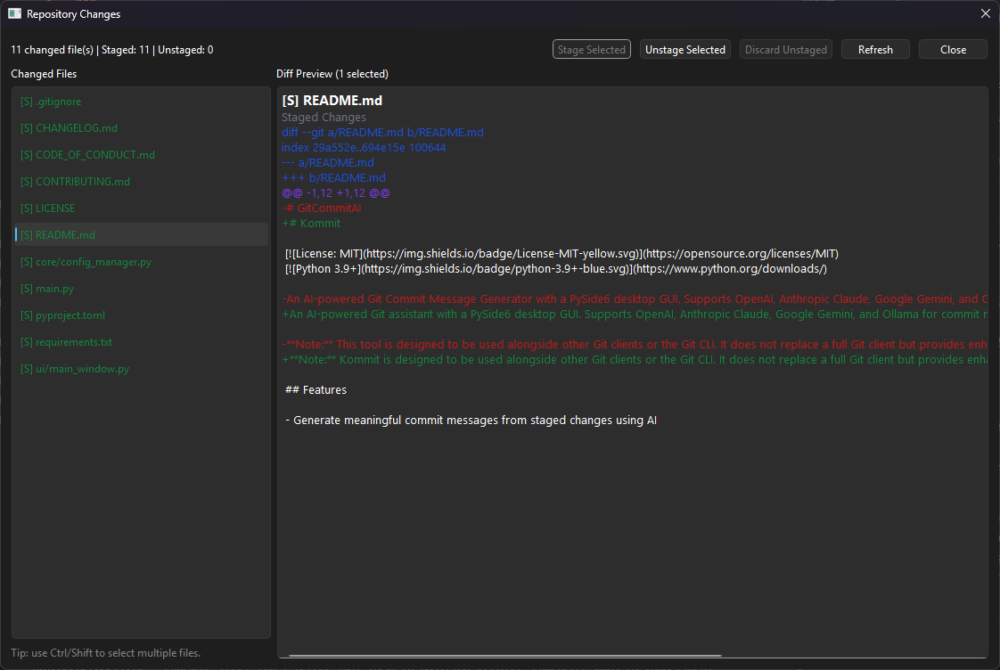
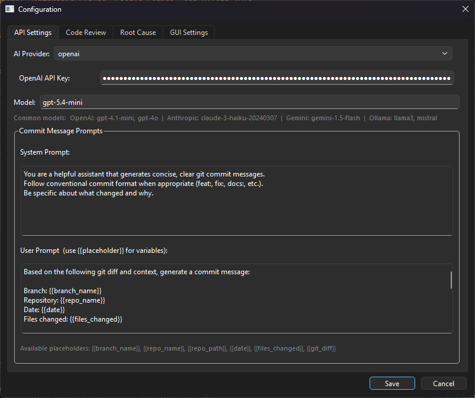
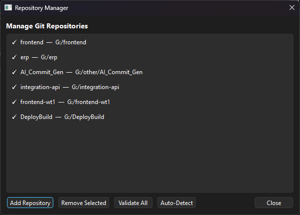
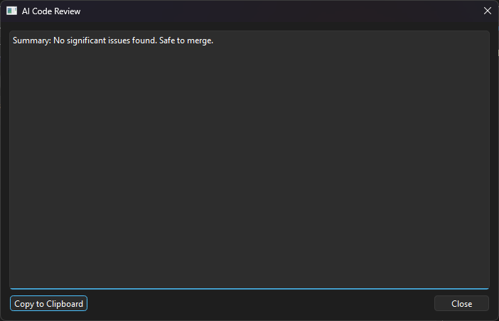
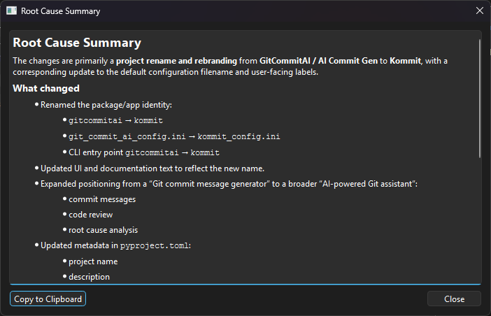

# Kommit

[](https://opensource.org/licenses/MIT)
[](https://www.python.org/downloads/)

An AI-powered Git assistant with a PySide6 desktop GUI. Supports OpenAI, Anthropic Claude, Google Gemini, and Ollama for commit message generation, AI code review, and root cause analysis.

**Note:** Kommit is designed to be used alongside other Git clients or the Git CLI. It does not replace a full Git client but provides enhanced commit message generation and code review capabilities.



<p>
  <a href="wiki-assets/20260501-0926AM-python-3561.png"></a>
  <a href="wiki-assets/20260501-0925AM-python-3559.png"></a>
  <a href="wiki-assets/20260501-0925AM-python-3560.png"></a>
  <a href="wiki-assets/20260501-0924AM-python-3557.png"></a>
  <a href="wiki-assets/20260501-0925AM-python-3558.png"></a>
</p>

## Features

- Generate meaningful commit messages from staged changes using AI
- AI-powered code review of all uncommitted changes (staged, unstaged, and untracked)
- Root cause summary generation from staged changes or branch diffs
- Support for multiple AI providers (OpenAI, Anthropic Claude, Google Gemini, Ollama)
- Multi-repository management with auto-detection
- Built-in changes dialog with syntax-highlighted staged/unstaged diff preview
- Branch panel with local and remote branch browsing and switching
- Commit actions: commit, commit and push, or commit and sync
- Raise pull requests directly from the app
- Open repository in terminal or file explorer
- Configurable system and user prompts with placeholder support
- Always-on-top window option
- Automatic package installation for missing AI provider SDKs

## Requirements

- Python 3.9+
- Git

## Installation

1. Clone or download the repository
2. Install the required packages:

```bash
pip install -r requirements.txt
```

Or install individual provider packages as needed:

```bash
# For OpenAI support
pip install openai

# For Anthropic Claude support
pip install anthropic

# For Google Gemini support
pip install google-genai

# For Ollama support (local models)
pip install ollama
```

You can also install missing provider packages directly from the app's configuration dialog.

## Usage

Run the application:

```bash
python main.py
```

1. Configure your API keys (or Ollama host) in the **Configure** dialog
2. Add your repositories via the **Manage Repos** button (or use **Auto-Detect**)
3. Select a repository from the dropdown
4. Click **Changes** to open the diff viewer and inspect changed files
5. In the diff viewer, select files to preview their diffs, then use **Stage Selected**, **Unstage Selected**, or **Discard Unstaged** as needed
6. Use the **Generate Actions** dropdown:
   - **Generate Commit Message** – analyses staged changes and produces a commit message
   - **AI Code Review** – reviews all uncommitted changes and presents findings in a dialog
   - **Root Cause Summary** – generates a root cause summary from staged changes or a branch diff
7. Use the **Commit Actions** dropdown to **Copy to Clipboard**, **Commit Staged Files**, **Commit and Push**, or **Commit and Sync**
8. Use the **Repository Actions** dropdown to **Open in Terminal**, **Open in Explorer**, or **Raise Pull Request**

### Diff Viewer

- Open the viewer with the **Changes** button beside the selected repository
- Review staged, unstaged, and new files in one list
- Select multiple files with Ctrl or Shift to preview combined diffs
- Stage, unstage, or discard changes directly from the viewer

### Branch Panel

- Browse local and remote branches in the right-hand tree panel
- Double-click any branch to switch to it
- Remote branches are automatically checked out as local tracking branches

### Commit Actions

- The **Commit Actions** dropdown stays disabled until a commit message has been generated
- Choose **Commit Staged Files**, **Commit and Push**, or **Commit and Sync**

## Configuration

Click the **Configure** button to access tabs for:

- **API Settings** – AI provider, API keys / Ollama host, model name, and commit message prompts (system and user prompts with `{{placeholder}}` support)
- **Code Review** – system prompt for AI code review
- **Root Cause** – system prompt for root cause summary generation
- **GUI Settings** – always-on-top toggle

## Troubleshooting

- Ensure your API keys are correctly configured (or that Ollama is running locally)
- Check that required packages are installed — the app will prompt to install missing provider packages
- Make sure you have staged changes before generating a commit message
- For root cause summaries without staged changes, the app will prompt you to select a comparison branch

## Contributing

See [CONTRIBUTING.md](CONTRIBUTING.md) for details on how to contribute.

## License

This project is licensed under the MIT License — see the [LICENSE](LICENSE) file for details.
